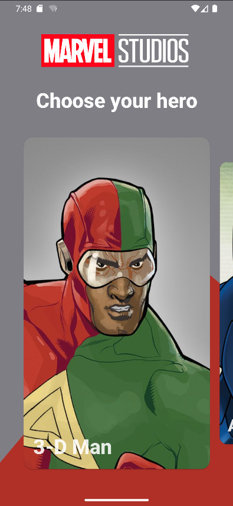
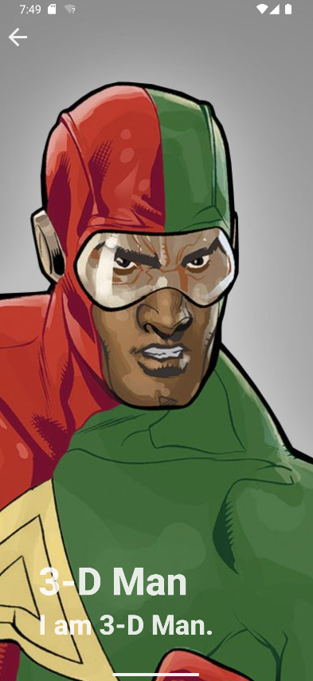
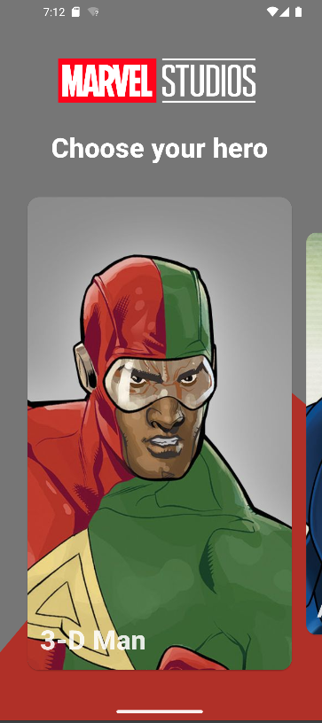
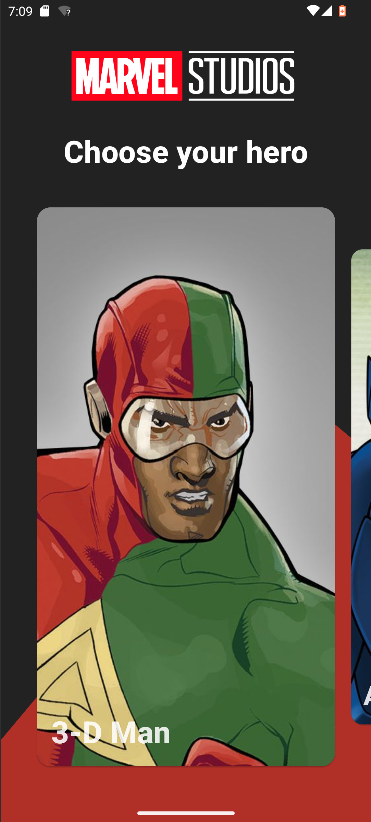

# Marvel

This application allows you to view and get to know the heroes of the **Marvel** universe.

### Application description

This application is a list of heroes, clicking on which opens more detailed information. Hero data
has been received [MarvelApi]('https://developer.marvel.com/''). If the application is connected to
the network, then the data is loaded automatically, in other cases, cached information from the
database is used.

You can also send notifications leading the user to specific hero's information card.

The app supports caching, light/dark theme, device orientation change, edge-to-edge screen,
right-to-left writing and english and russian locales.

## Screenshots

|                  Main Screen                  |                  Info Screen                  |
|:---------------------------------------------:|:---------------------------------------------:|
|  |  |

|                  Main Screen                  |                  Info Screen                  |
|:---------------------------------------------:|:---------------------------------------------:|
|  |  |

## Theming

|                Light Theme                |                Dark Theme                |
|:-----------------------------------------:|:----------------------------------------:|
|  |  | 

## Topics

* Navigation
* Architecture MVI
* Paging
* Theming
* Network
* FCM
* Compose Based UI
* Gradle Configuration

## Architecture

## How to run

You need Android Studio (*at least Dolphin | 2021.3.1*) with Kotlin plugin (*at least 1.7.10*)

Server-side applications must pass parameters in addition to the apikey parameter:

* ts - a timestamp (or other long string which can change on a request-by-request basis)
* apikey - Your public key
* hash - a md5 digest of the ts parameter, your private key and your public key (e.g. md5(
  ts+privateKey+publicKey)

Sync project with the gradle files

Run -> Run 'app'

## Who to contact with questions

* [Korotaeva Vasilisa]('https://github.com/KorotaevaVasilisa')